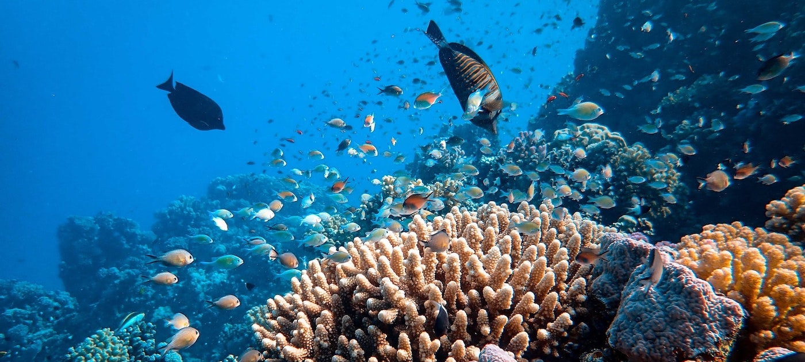
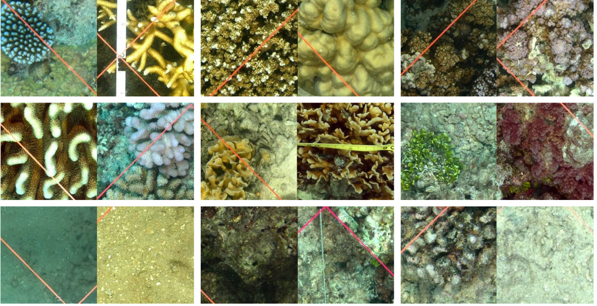
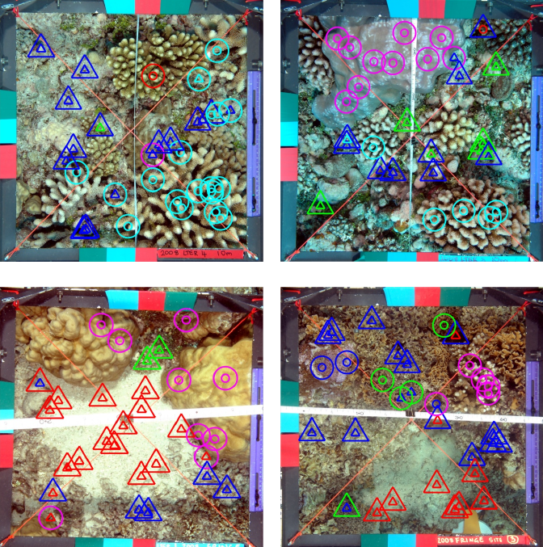
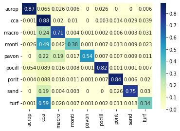
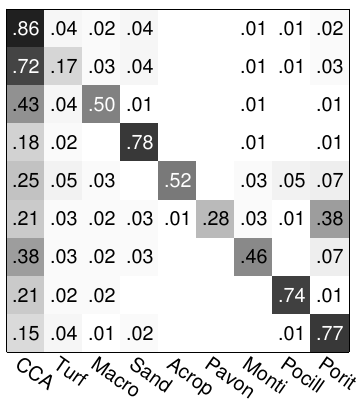

# Coral Reef Annotations

*unep.org/*

## Introduction
Coral reef ecosystems cover around 0.1% of the world's ocean yet boast a wealth of natural diversity. It has been estimated that around 25% of marine species inhabit this area (Spalding et al, 2008). However, in recent years there has been a sharp decline in the health of coral reefs around the world. This is due to a myriad of reasons including climate change, pollution, and unsustainable coastal development, according to the [United Nations Environment Programme](https://www.unep.org/news-and-stories/story/why-are-coral-reefs-dying#:~:text=And%20they%20are%20dying.,pollution%20and%20unsustainable%20coastal%20development.). Recent statistics by the [Global Coral Reef Monitoring Network](https://gcrmn.net/2020-report/) show that 14% of the world’s corals were lost between 2009 and 2018. This trend is projected to continue with about 70%-90% in live corals by 2050. 

In order to aid conservation efforts and inform environmental policies, it is important to keep track of the coverage statistics of coral reefs. Aerial and satellite images have been used for this purpose. To further understand the factors which contribute to the decline and abundance of coral reefs, marine ecologists usually need to perform in situ studies in order to determine the number of different coral species and algae in a given area. 

Recent efforts have been made to create high-quality survey images of coral reefs. However, manual annotation is often tedious and expensive and the expertise of marine ecologists can be better used elsewhere. It has been claimed that as little as 1-2 % of captured images get annotated. In this project, I explore ways to perform automatic annotation of high-resolution, close-range survey images of coral reefs. The dataset for this project is taken from the Moorea Coral Reef Long Term Ecological Research [MCRLTER](http://mcr.lternet.edu/). 

The Colab Notebook can be found [here](https://colab.research.google.com/drive/1BdOVKfzQDa5M9Nl6r9FscYYf4isn3kRT?usp=sharing)
[Here](ab) is the link to a short video presentation.
An additional notebook containing some preprocessing and visualization can be found [here](ab).

## Moorea Labeled Corals Dataset (MLC)

The Moorea Labeled Corals dataset (Beijbom et al, 2012) contains 2055 high-resolution underwater images taken from six sites around the island of Moorea in French Polynesia. The data is evenly distributed across 3 years (2008, 2009, 2010).  The data is annotated using random sampling, in which experts assign one of 30 labels to randomly selected pixels in the image. Each image contains roughly 200 annotated points. Nine classes account for 96% of the dataset. These can be further divided into corals and non-corals.

 
<em>Sample Patches from (Beijbom et al, 2012)</em> 

The main task to be automated is then to label random pixels in a given image. The authors  of the dataset (Beijbom et al, 2012) argue that “A full manual segmentation would be too time-consuming to collect and neither bounding boxes nor gross image labels provide the level of detail needed.” Additionally, there is high variability in the size, color, and shape of corals and the boundaries are often ambiguous. 

  
  
  <em>Images and Annotations from the MLC dataset</em> 

## Method
The general approach I use for this problem is to extract patches centered around the annotated points from the high-resolution image and run them through a classifier. 

### Previous Approach

Beijbom et al (2012) initially used 61x61 patch sizes together with a rotational invariant filter bank. These are then fed into a Support Vector Machine if an RBF kernel in order to classify the patches. Using the method above, the authors achieved a 0.74 accuracy score when classifying patches within the same year. This is however reduced to 0.67 when training on the data collected from 2008 and testing on 2009 data. 

### Preprocessing

I started out by extracting square patches of different sizes in order to find which one is best. I used the annotated pixel as the center and cropped patches from the image. I decided to ignore patches that would lie outside the image since the patches are small enough as they are and I did not want to introduce additional noise into the dataset. In practice, there were only a very small number of patches that were dropped by this method. Good patch sizes are important since a small patch size would not include enough visual information and large patch sizes may include other coral types which may further confuse the classifier. I found that 128x128 patches performed slightly better than 64x64 and were on par with larger patches. This more or less coincides with the findings of the original paper. I tested these on a small subset of the data using a simple convolutional network. This was done to conserve GPU runtime on Colab. 

Additionally, I played around with the contrast and saturation but it was difficult to determine whether this affected the final results in an impactful way. I deemed data augmentations techniques such as random flips and crops to be unnecessary for classifying coral patches, however, I did not rigorously test them out. Finally, I extracted 3x128x128 tensors and normalized them in order to make the data compatible with models that were pre-trained on Imagenet. I used bilinear resizing to fit the input dimensions of different pre-trained models. 

### Models 

I tested out three models: a simple two-layer CNN, pre-trained Resnet18, and GoogLenet. I intended to use the small CNN model as a baseline and to see how it compared to the results from the previous approach which used SVMs. The model architecture for the CNN classifer was taken from the PyTorch [tutorial](https://pytorch.org/tutorials/beginner/blitz/cifar10_tutorial.html) for classifying CIFAR dataset. It consists of two convolutional layers with kernel size 5 and 6 and 16 output channels respectively. Max pooling is used between the layers and the results of the convolutions are passed into 3 Linear layers with ReLU activations. 

The next I tested pre-trained image recognition models. I chose Resnet18 (He, 2016) and Googlenet, a.k.a Inception V1 (Szegedy, 2014) due to their strong performance on image classification tasks as well their relatively small size, low fine-tuning time, and ease of use within PyTorch. I used the SGD optimizer for 5 epochs. I noticed that the small CNN had trouble converging and increased the training epochs for it to 10 while the rest of the pre-trained models remain the same. The training script from the PyTorch tutorial was used and I slightly modified it to output accuracies on the validation set after every epoch. A learning rate scheduler with 0.1, 0.001, and 0.001 was used with the later epochs having a smaller learning rate. Fine-tuning for Resnet18 and Googlenet took around 10-15 minutes per epoch on Google Colab GPU.

## Results

Beijbom et al (2012) conducted several experimental setups. These include binary classifications (e.g coral vs. non-coral), within-year and across years. I decided to focus on the between-year fine-grained classification task with 9 labels. For this, the models were trained on the 2008 dataset consisting of around 600 images and tested on the equally large 2009 dataset. The original dataset used a 3-fold validation technique to determine the classification performance on the intra-year setup. I decided to use the 2008-2009 setup because the splits for the intra-year experiment were not provided and I believe this is the best way to compare model performance. The 2008-2009 setup is also harder with the original models achieving only 0.67 accuracy. 

Although I did not perform rigorous within-year classification, I still set aside a small subset of the 2008 data split for testing and validation purposes. My models as well as the models from the original paper performed significantly better on unseen images from the same year. This might be due to the different lighting conditions as well as other environmental factors. 

|             | Random | SVM Baseline | Small CNN | Resnet18 | GoogleNet |
|-------------|--------|--------------|-----------|----------|-----------|
| Accuracy    | 0.29   | 0.67         | 0.59      | 0.71     | 0.74      |
| F1          | -      | -            | 0.35      | 0.59     | 0.68      |
| Weighted F1 | -      | -            | 0.57      | 0.73     | 0.73      |

The table above shows the classification results for different models. The random and SVM baselines are taken from the original paper. As expected, the small CNN performed rather poorly. This was more or less expected and its poor performance suggests that the small CNN lacks the complexity to handle this dataset. However, it was still rather surprising how poorly it compared to a non-deep learning method. This goes to show that meticulously filters in addition to old-school machine learning methods can still perform very well. 

With the pre-trained models, there is a significant increase in performance with GoogleNet, the best performing model, achieving a 7% increase over the SVM baseline. These results show that deeper and larger models perform better as well as the viability of transfer learning from generic image recognition tasks to domain-specific tasks such as underwater coral patch classification in this case. 

A systematic pattern of misclassification is evident when further examining the errors produced by the models. Depicted below is the confusion matrix of the Googlenet model on the 2009 data split. The largest source of misclassification is due to the models confusing Crustose Coralline Algae (CCA) for various types of corals, especially with Montipora corals. 

  

This systematic misclassification was also evident in the SVM baseline below.

*Confusion Matrix from Beijbom et al's SVM classifier*

 There are a few possible explanations for this that may not be mutually exclusive. Firstly, the dataset is highly imbalanced and Crustose Coralline Algae account for around half of all the patches. This can result in the models being biased towards predicting CCA in the absence of information. It was also noted by the authors of the dataset that CCA and Turf algae are notoriously difficult to distinguish resulting in poor inter-annotator agreement in other datasets. Another reason for the confusion is that CCA usually grows on dead corals! These overgrown dead corals are then classified as CCA. 
 
 This fact might actually be a hard constraint on how well the models can perform. Although the authors of the dataset do not provide inter-annotator agreements, similar coral patch classification datasets only show around 80%-90% inter-annotator agreements. This gets especially worse when experts are asked to differentiate between algae species such as CCA and turf algae. In short, this dataset is hard and might require additional knowledge that is not visually present. Human experts are also not that good at differentiating seaweed types. 

## Further Work 

Another approach with using this dataset would be to try to cast it into a segmentation problem. Perhaps there is a way to use the small number of annotations given in order to generate rough masks over the images. This may be useful for obtaining high-quality statistics about coral coverage. Or maybe the segmentations could be trained in a semi-supervised manner where only a small number of pixel are labeled according to class.  

## References
- Spalding, M., Ravilious, C., & Green, E.P. (2001). World atlas of coral reefs.
- Beijbom, O., Edmunds, P.J., Kline, D.I., Mitchell, B.G., & Kriegman, D.J. (2012). Automated annotation of coral reef survey images. 2012 IEEE Conference on Computer Vision and Pattern Recognition, 1170-1177.
- He, K., Zhang, X., Ren, S., & Sun, J. (2016). Deep Residual Learning for Image Recognition. 2016 IEEE Conference on Computer Vision and Pattern Recognition (CVPR), 770-778.
- Szegedy, C., Liu, W., Jia, Y., Sermanet, P., Reed, S.E., Anguelov, D., Erhan, D., Vanhoucke, V., & Rabinovich, A. (2015). Going deeper with convolutions. 2015 IEEE Conference on Computer Vision and Pattern Recognition (CVPR), 1-9.
