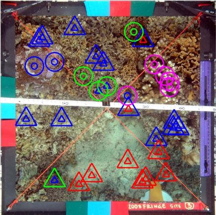

# Coral Reef Annotations

*unep.org/*

## Introduction
Coral reef ecosystems cover around 0.1% of the world's ocean yet boast a wealth of natural diversity. It has been estimated that around 25% of marine species inhabit this area. However, in recent years there has been a sharp decline in the health of coral reefs around the world. This is due to a myriad of reasons including climate change, pollution, and unsustainable coastal development (UNEP). Recent statistics show that 14% of the world’s corals were lost between 2009 and 2018 (Global Coral Reef Monitoring Network). This trend is projected to continue with about 70%-90% in live corals by 2050 (UNEP). 

In order to aid conservation efforts and inform environmental policies, it is important to keep track of the coverage statistics of coral reefs. Aerial and satellite images have been used for this purpose (CITE). To further understand the factors which contribute to the decline and abundance of coral reefs, marine ecologists usually need to perform in situ studies in order to determine the number of different coral species and algae in a given area. 

Recent efforts have been made to create high-quality survey images of coral reefs. However, manual annotation is often tedious and expensive and the expertise of marine ecologists can be better used elsewhere. It has been claimed that as little as 1-2 % of captured images get annotated. In this project, I explore ways to perform automatic annotation of high-resolution, close-range survey images of coral reefs. The dataset for this project is taken from the Moorea Coral Reef Long Term Ecological Research (MCRLTER). 

## Moorea Labeled Corals Dataset (MLC)

The Moorea Labeled Corals dataset contains 2055 high-resolution underwater images taken from six sites around the island of Moorea in French Polynesia. The data is evenly distributed across 3 years (2008, 2009, 2010).  The data is annotated using random sampling, in which experts assign one of 30 labels to randomly selected pixels in the image. Each image contains roughly 200 annotated points. Nine classes account for 96% of the dataset. These can be further divided into corals and non-corals.

 
<em>Sample Patches</em> 

The main task to be automated is then to label random pixels in a given image. The authors of the dataset argue that “A full manual segmentation would be too time-consuming to collect and neither bounding boxes nor gross image labels provide the level of detail needed.” Additionally, there is high variability in the size, color, and shape of corals and the boundaries are often ambiguous. 

<em>Random Point Annotations</em> 

## Method
The general approach I use for this problem is to extract patches centered around the annotated points from the high-resolution image and run them through a classifier. 

### Previous Approach

The creators of the dataset initially used 61x61 patch sizes together with a rotational invariant filter bank. These are then fed into a Support Vector Machine if an RBF kernel in order to classify the patches. Using the method above, the authors achieved a 0.74 accuracy score when classifying patches within the same year. This is however reduced to 0.67 when training on the data collected from 2008 and testing on 2009 data. 

### Preprocessing

I started out by extracting square patches of different sizes in order to find which one is best. I used the annotated pixel as the center and cropped patches from the image. I decided to ignore patches that would lie outside the image since the patches are small enough as they are and I did not want to introduce additional noise into the dataset. In practice, there were only a very small number of patches that were dropped by this method. Good patch sizes are important since a small patch size would not include enough visual information and large patch sizes may include other coral types which may further confuse the classifier. I found that 128x128 patches performed slightly better than 64x64 and were on par with larger patches. This more or less coincides with the findings of the original paper. I tested these on a small subset of the data using a simple convolutional network. This was done to conserve GPU runtime on Colab. 

Additionally, I played around with the contrast and saturation but it was difficult to determine whether this affected the final results in an impactful way. I deemed data augmentations techniques such as random flips and crops to be unnecessary for classifying coral patches, however, I did not rigorously test them out. Finally, I extracted 3x128x128 tensors and normalized them in order to make the data compatible with models that were pre-trained on Imagenet. I used bilinear resizing to fit the input dimensions of different pre-trained models. 

### Data & Preprocessing

### Classification Models

### Results

### Discussion

### Further Work 

